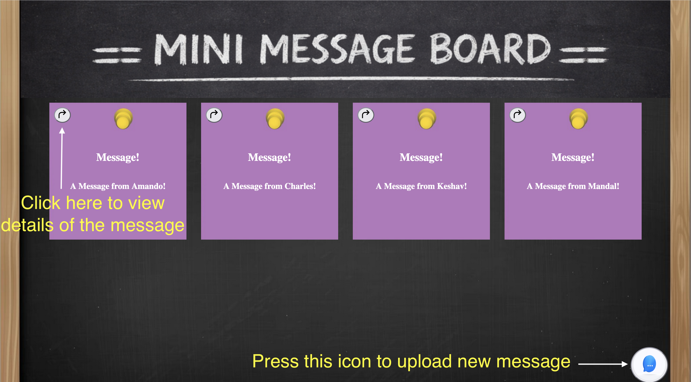

# mini-message-board
The following project is of mini message board which can be used to post your messages.

A new message can be posted by clicking on the following icon which will open a form to enter your message and name.To view the message click on the arrow sign in the message card

This project was made with Express,Postgres SQL and is deployed on railway

The live demo of the project can be found on 
https://mini-message-board-production-5bf7.up.railway.app/

